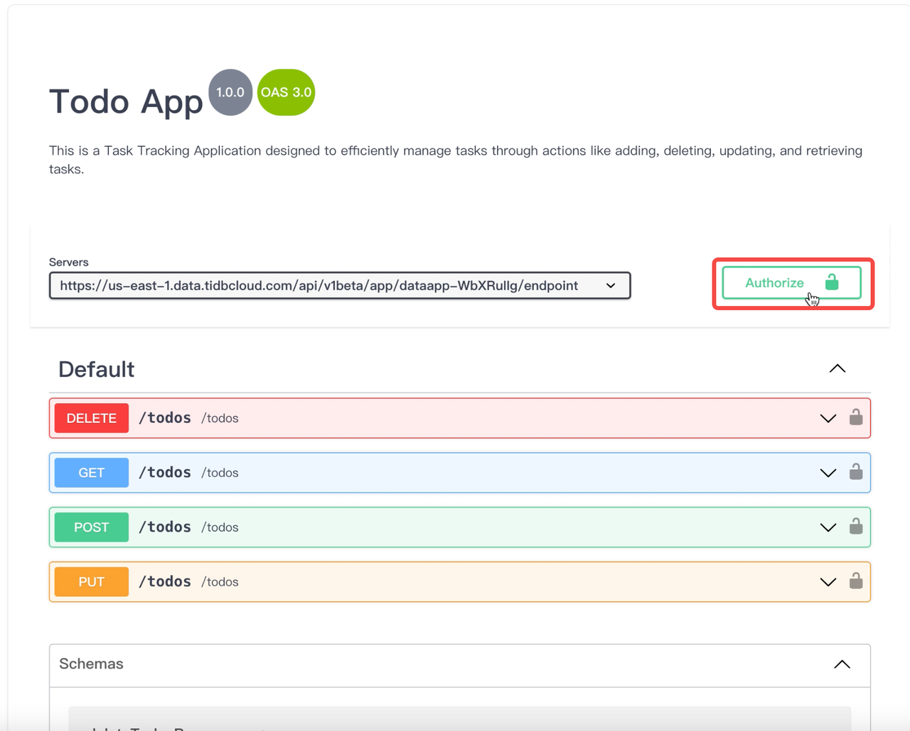

# TiDB Cloud Data Service - Task Tracker Application.
The primary goal is to provide users with  guidance in constructing REST endpoints using TiDB Cloud Data Service (TCDS). To enhance the learning experience, we will actively engage in building a [Task Tracker application](https://task-tracker-two-ashen.vercel.app/) throughout the tutorial. This hands-on approach ensures that by the end of this  learning journey, you will have not just acquired knowledge but also a tangible, functional Task Tracker application—an exciting outcome of your newfound skills.
While the React frontend is hosted on [Vercel](https://vercel.com), this guide predominantly focuses on the backend development process. You will be led through the creation of vital backend components, including clusters and tables, alongside the insertion of sample data. Later, the tutorial will also demonstrate how to craft backend APIs using TCDS. Towards the end, we'll guide you in seamlessly integrating your React frontend with the backend APIs you've developed, culminating in hosting the entire application on Vercel.
By the end of this tutorial, you will not only grasp TCDS intricacies but also possess a fully functional backend solution. This tutorial ensures accessibility for both beginners and seasoned developers, offering a transformative learning experience.
A complete task tracker application with all features.

**live demo: [https://task-tracker-two-ashen.vercel.app/](https://task-tracker-two-ashen.vercel.app/)**

## Set up a TiDB Serverless Cluster
Take the steps below to create a free TiDB Serverless cluster:
1. [Sign in](https://tidbcloud.com/) to your TiDB Cloud. Register a [TiDB Cloud](https://tidbcloud.com/free-trial?__hstc=86493575.ea015085c8a32000ad5a5e1466ed2d06.1697839011824.1703268569892.1704819917984.73&__hssc=86493575.2.1704819917984&__hsfp=323772859) account if you haven’t got one.
2. Follow the on-screen instructions to create a free Serverless Tier cluster within seconds.

## Create  Data Model
1. Navigate to the overview page of the cluster you created previously.
   On the left navigation pane, select the **Chat2Query** interface. Execute the SQL script provided below to create both the `tasktracker` database and the `todos` table within it. The script also includes the insertion of sample data into the `todos` table. The Task Tracker application relies on this todos table to store individual tasks along with their related information, including title, description, status, and timestamps.
   

``` shell 
CREATE DATABASE tasktracker;
USE tasktracker;

CREATE TABLE todos (
`id`INT AUTO_INCREMENT NOT NULL PRIMARY KEY,
`task`VARCHAR(255) NOT NULL,
`description` TEXT,
`status`VARCHAR(50) NOT NULL,
`created_at` timestamp NULL DEFAULT CURRENT_TIMESTAMP,
`updated_at` timestamp NULL DEFAULT CURRENT_TIMESTAMP ON UPDATE CURRENT_TIMESTAMP
)ENGINE=InnoDB AUTO_INCREMENT=1 DEFAULT CHARSET=utf8mb4;

INSERT INTO todos (task, description, status) VALUES
('Grocery Shopping', 'Buy groceries for the week including fruits, vegetables, and dairy products', 'Incomplete'),
('Email Client', 'Send the revised project proposal to the client by EOD', 'Incomplete'),
('Gym Session', 'Attend the 6 PM cardio fitness class at the local gym', 'Completed'),
('Book Flight Tickets', 'Book tickets for the upcoming business trip to New York', 'Incomplete'),
('Annual Health Checkup', 'Schedule an annual health checkup appointment with Dr. Smith', 'Completed');

SELECT * FROM todos;
``` 
> **Note:**
>
> Ensure you execute all the statements in the script by selecting them and clicking on the 'Run' button

## Create a Data App with GitHub Integration
Assuming the excution of the script successful, the next step is to create a Data App, which serves as the initial phase for generating REST Endpoints. Data App is a container that consists of a collection of objects like Endpoints. Please refer to our [documentation](https://docs.pingcap.com/tidbcloud/data-service-manage-data-app/) for comprehensive details on managing a Data App.
1. Select **Data Service** from the left navigation menu. To create a Data App, simply click the **Create Data App** button.
   
2. Create a **Standard Data App**
- In the **Create Data App** screen, input `Todo App` for the **Data App Name** field, and choose the containing cluster (in our case, `Cluster0`) for Link Data Sources.The 'Description' field, though optional, offers additional context about the Data App; Input `This is a Task Tracking Application designed to efficiently manage tasks through actions like adding, deleting, updating, and retrieving tasks`. for the **Description**. Keep the `Data App Type` at its default.
- **Connect to GitHub (Optional)**: Integrating GitHub aims to enhance the CI/CD experience for developers and DevOps personnel who build Data Apps using TiDB Cloud's Data Services. By integrating with GitHub, you can link a GitHub repository and a specific branch to your TiDB Cloud's Data Service project. This allows for the automatic deployment of your Data App's metadata and endpoints, stored in a specified directory, directly to the connected project. Our goal is to develop an application with both frontend and backend code hosted in a GitHub repository. Here are the steps to link GitHub:
    - <a name="custom-id"> In a new browser window, log in to your GitHub account and create a new repository named `todo-app` for the task tracker project.</a>
    - Navigate back to the Create Data App screen, click `Install on GitHub`, and then follow the on-screen instructions to install TiDB Cloud Data Service as an application in your target repository.
    - Click `Authorize` to authorize access to the task tracker application on GitHub.
    - Specify the `todo-app` repository, branch (e.g., main) , and directory (e.g., /backend) for storing configuration files, enabling TCDS to complete the backend API creation process.
- Click the “**Create**” button to create your Data App.
  
  After creating the Data App, you'll land on the Data App Home page. For first-time users, a 'Getting Started with Data Service' tutorial is available. However, we won't use this guided tour in this tutorial. Instead, we'll manually walk through each step of creating the endpoints, click the '-' minimize button to close it.
  
## Create Endpoint
For this tutorial, you'll create four HTTPS endpoints (POST, GET, PUT, DELETE) to execute CRUD operations on the 'todos' table. The process for creating the first endpoint will be detailed, providing guidance for the remaining three. The subsequent endpoints follow a similar pattern with minor tweaks, such as adjusting SQL or endpoint configurations (e.g., Properties, Params). For more detailed information, refer to our [documentation](https://docs.pingcap.com/tidbcloud/data-service-manage-endpoint#create-an-endpoint) on creating new endpoints.
1. `POST /todos` endpoint

    The POST /todos endpoint will allow you to add a new task to the 'todos' table, facilitating the create operation.
- On the left navigation bar of the `Todo App`, click the “+” symbol, and select `Create Endpoint` option.
  
  - **Configure Endpoint Properties**
    Under the ‘Properties’ tab,
    Enter the `Path` as "**/todos**".
    Set the `Request Method` to **POST** .
    >   **Note:**
    >
    >  The endpoint name is automatically inferred from the path value entered by default.

  For more information on configuring endpoint properties, please refer to our [documentation](https://docs.pingcap.com/tidbcloud/data-service-manage-endpoint#configure-parameters).
  

- **Configure  SQL**
  The SQL configuration serves as the backbone of our endpoint, defining the core business logic. In the context of this endpoint, designed to create a task, the provided SQL below specifically inserts a new record into the `todos` table.
    ```shell
    USE tasktracker;
    INSERT INTO `todos` (`task`,`description`,`status`)
    VALUES (${task},${description},${status});
    ```
  Copy the SQL script into the natively provided `SQL Editor window` as shown below,
  
- **Configure Endpoint Parameters**
  Parameters are variables that enhance the flexibility and dynamicity of your endpoint. Parameters are automatically generated for you in this process. All you need to do is review the default parameter configuration and make adjustments to suit your specific needs.
  Navigate to the `Params` tab to explore numerous configuration options:

  1. Setting `Required` makes a parameter mandatory.
  2. Configure the parameter type to align with the underlying data model.
  3. Additional options include 'enum value,' 'default value,' and 'description,' all of which are optional.
     For our todos endpoint , there's no content that needs updating, so maintaining the default values will suffice.
     Refer to our [documentation](https://docs.pingcap.com/tidbcloud/data-service-manage-endpoint#configure-parameters) for comprehensive details on configuring endpoint parameters.
     
  Congratulations on successfully creating your first POST /todos endpoint!
  Now, let's leverage this knowledge to create the remaining endpoints.
2. `GET /todos`
   
    The GET /todos endpoint will retrieve all tasks stored in our todos table.
- **Configure Endpoint Properties**
  Under the ‘Properties’ tab,
  Enter the `Path` as "**/todos**".
  Set the `Request Method` to **GET** (default) .
- Configure  SQL
  ```shell
  USE tasktracker;
  SELECT * FROM `todos` ;
  ```
  >   **Note:**
  >
  >The GET /todos endpoint will not have any parameters
3. `PUT /todos`
   
    The PUT /todos endpoint will be used to update a task, especially when the task status changes.
- **Configure Endpoint Properties**
  Under the ‘Properties’ tab,
  Enter the `Path` as "**/todos**".
  Set the `Request Method` to **PUT** .
- **Configure  SQL**
  ```shell
  USE tasktracker;
  UPDATE `todos` SET
  `status` = IF(length(${status})>0,${status},`status`),
  `task` = IF(length(${task})>0,${task},`task`),
  `description` = IF(length(${description})>0,${description},`description`)
  WHERE `id` = ${id} ;
  ```
- **Configure Endpoint Parameters**
  As you can see in the SQL script above, each task is identified and updated using its `id`. It's important that the `id` parameter be configured as `Required` and its corresponding type to be changed from its default value i.e string to `Number` to match the type of the `id` field in todos table as shown below,
  
4. `DEL /todos`
   
    The DELETE /todos endpoint will be used to delete a task.
- **Configure Endpoint Properties**
  Under the ‘Properties’ tab,
  Enter the `Path` as "**/todos**".
  Set the `Request Method` to **DELETE** .
- **Configure  SQL**
  ```shell
  USE tasktracker;
  DELETE FROM `todos` WHERE `id` = ${id} ;
  ```
- **Configure Endpoint Parameters**
  As you can see in the SQL script above, each task is identified and updated using its `id`. It's important that the `id` parameter be configured as `Required` and its corresponding type to be changed from its default value i.e string to `Number` to match the type of the `id` field in todos table as shown below,
  
  
## Test Endpoint
  Now that we've successfully created the CRUD (Create, Read, Update, Delete) endpoints for tasks, it's crucial to test them locally to ensure they meet your business needs before making them available for the client application to consume.
  Let's use the `POST /todos` endpoint as an example to demonstrate how you can effectively test the endpoints within the TCDS environment.
- In the Endpoints list select `POST /todos`.
- Under the `Params` tab, navigate to the 'Test Values' section.
- Enter the text **Pay Internet Bill** as the test value for the `task`.
- Enter the text **May Internet Bill** as the test value for the `description`.
- For status, enter the text **Incomplete** as the test value.
  After configuring the test value, click the Test button on the upper right corner of the screen as shown below,
  
  You should see a **Http Response** with a `status code 200`. This means  you have  successfully completed testing the `POST /todos` endpoint. Keep in mind that there are still three more endpoints— for updating, deleting, and viewing tasks— that also require testing. Follow similar steps to ensure the robust functionality of each endpoint in your application.
  
## Deploy Endpoint
  Assuming you have been following along and successfully tested the endpoints, it's time to make them publically available for external clients. To do so,
   1. Click `Deploy` button.
      
   2. A `Review Changes Dialog` will pop up, allowing you to perform a final verification of your edits to ensure they're just the way you want before proceeding with deployment.
      Review the changes and click the `Deploy and Push to GitHub` button to make the endpoint publicly available.
      
      Repeat the deployment process for the remaining endpoints, then navigate to GitHub to verify that the `backend/http_endpoints` folder you configured earlier now contains configuration files associated with the deployed endpoint as shown below,
      

## Create API Key
Before you start exploring your new endpoints, you’ll need to set up an API Key for secure authentication. Here’s how to create one:
1. Navigate to your Data App’s home page by clicking on the **Todo App**.
2. Inside the **Settings** menu, find the authentication section and click the **Create API Key** button.
   
3. In the **Create API Key** popup screen, specify the following:
- **Description**: Add the text **TaskTrackerKey**.
- **Role**: Set the role to **ReadAndWrite** since you will be reading and writing into the `todos` table.
4. Click **Next** to generate a Public Key and a Private Key. Copy and securely store both keys in a safe and easily accessible place. Remember, you won't be able to access the Private Key again once you leave this screen.
   
5. Click **Done** to return to the Data App home screen.
   Your API Key is now created and ready to be used for authentication with your newly created endpoints.

## Explore Endpoints
   Now that your API Key is set up, it’s time to delve into your newly created endpoints. There are two straightforward methods to accomplish this:
- **API Docs**: Utilize the built-in Swagger documentation provided by TiDB Cloud Data Services.
- **Postman**: Leverage the integrated Postman support within TiDB Cloud Data Service.
  For the purpose of this blog, we will use API Documentation via  Swagger UI. If you want to learn more about Postman integration, refer to our [documentation](https://docs.pingcap.com/tidbcloud/data-service-postman-integration).
1. On the Data App home page, click **View API Docs**.
   
2. In the new browser window, you will find the API documentation generated through Swagger UI adheres to the [Open API Specification](https://swagger.io/specification/). Click the **Authorize** button located in the top right corner.
3. Enter the Public Key as the username and the Private Key as the password—both of which were obtained during the API Key creation process.
   
   This concludes the process of creating our backend application.
   You can now create, retrieve, update, and delete todos data through the secure endpoints using the POST, GET, PUT, and DELETE methods.

## Visualizing with Vercel
   Congratulations! You are just one step away from fully completing the development of your task tracker application. All that's left is to finalize the frontend presentation, and then we can launch the application. We will be using Vercel for deploying the front-end project. If you want to learn more about Vercel, refer to the [documentation](https://vercel.com/docs/getting-started-with-vercel).
   >   **Note:**
   >
   >Although this is an optional step, we highly encourage our readers to complete this step to see a full blown task tracker application in action
### Prerequisite
   Before you begin, you will need to set up the following:
- [Git](https://git-scm.com/book/en/v2/Getting-Started-Installing-Git)
### Integrate Frontend Code
- We have provided a [sample code](https://github.com/tidbcloud/task-tracker) example for implementing the front-end component of task tracker. All you will need to copy the **frontend folder**  from this repository to your own todo-app repository [that we created earlier](#custom-id)  .
- Open a Git Bash terminal and execute the following steps,
```shell
# clone repo for backend code
git clone ${YOUR_REPO_FOR_TCDS_SSH}

# clone repo for frontend code
git clone https://github.com/tidbcloud/task-tracker

# copy frontend code to your repo
cd task-tracker
# The target directory is your backend repo directory. In our case, the location is ../todo-app
cp -r ./frontend ../todo-app/

# push frontend code to your repo location.
# Use your repo directory if it is not todo-app. In our case, the location is ../todo-app.
cd ../todo-app
git add ./frontend
git commit -m "add frontend code for app"
git push
```
>   **Note:**
>
>Replace ${YOUR_REPO_FOR_TCDS_SSH} with link to the todo-app repository    

At the end of this step, your GitHub repository will have the `frontend folder` as shown below ,

### Configure Vercel Project
- Visit [Vercel's website](https://vercel.com/) and sign up and/or log in.
- Once logged in, click on "Add New" -  "Project".
  
- Previously created `todo-app` GitHub repository should automatically appear on the screen. Click on `Import` to add this repository to your Vercel project.
  >   **Note:**
  >
  >If your GitHub repository doesn't  automatically appear in the list, configure it based on the 'Adjust GitHub App Permissions' prompt on the screen. This step grants Vercel the necessary permissions for your GitHub repository.

   
- In the Configure Project screen,
    - Configure the project name as "**task-tracker**".
    - For framework select "**Create React App**".
    - Edit the root directory by clicking the `Edit` button and select the `frontend folder`.
      
- Configure Environmental Variables
  In your Vercel project, securely store and retrieve essential TCDS endpoint data by placing the confidential information in environment variables. We will be configuring three environmental variables as shown below.
    - **REACT_APP_APIURL** : This is the TCDS endpoint URL, to get this URL go back to your "Todo App"  Data App and select any endpoint from the endpoint list.  The Endpoint URL can be found under the Properties tab as shown below
      
    - `REACT_APP_PUBLICKEY` and `REACT_APP_PRIVATEKEY` you should already have this from the Create API Key step.
  >   **Note:**
  >
  >All variable names should be prefixed with REACT_APP_.
### Deploy Vercel Project
- Now that you have all the configurations in place its time to deploy your vercel project and see it in action. To deploy simply click `Deploy` button and wait for a couple of minutes for the deployment to succeed.


- Upon successful deployment, click on `Continue to Dashboard` to get the Vercel app domain setup and then click `Visit` to access the UI of the task tracker application.

- After entering dashboard, you can view the detailed information about the deployment. Clicking on "Visit" allows you to access UI of the task tracker application as shown below,


## Citation

This project is based on the original work by Shaif Arfan available at [react-todo-app](https://github.com/ShaifArfan/react-todo-app).
Modifications were made to The modifications include replacing the original frontend storage for the to-dos with backend API calls to a TCDS. Additionally, some adjustments have been made to the UI to accommodate our existing data set.

Happy Coding! 🚀
